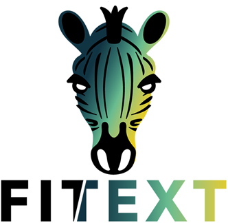

<h1 align="center">fitext</h1>

Fitext is a module which adapts the textual elements so that they are always contained in their parents without ever exceeding whatever the parent height and width. This [lightweight](#performance-tips) library using no-one dependency. **You can find a playable demo [here](https://pierredarrieutort.github.io/fitext/).**

<div align="center">
    
</div>

## Table of contents

1. [Installation](#installation)
2. [Getting Started](#getting-started)
3. [Example](#Example)
4. [Using a CDN](#using-a-cdn)
5. [Options](#options)
6. [Performance Checklist](#performance-tips)
7. [Contributors](#contributors)
8. [License](#license)

## Installation

```shell
$ npm install --save fitext
```
```shell
$ yarn add fitext
```

## Getting Started

**HTML :**
```html
<body>
    <div class="fit-this-text">
        <h1>Resize your window</h1>
        <h2>Play with responsive 💡</h2>
        <p>Insert a huge lorem ipsum text !</p>
    </div>
</body>
```

**ES6 Modules :**
```js
import fitext from 'fitext'

fitext(true);
```

**No-module :**
```html
<script src='dist/fitext.min.js' defer></script>
<script>
    window.addEventListener('DOMContentLoaded', function() {
        fitext(true);
    });
</script>
```

## Example

```js
import fitext from 'fitext'


const EVENTS = ['DOMContentLoaded', 'resize']

EVENTS.forEach( e => window.addEventListener( e, fitext ) )
//OR
EVENTS.forEach( e => window.addEventListener( e, () => fitext(true, .25) ) )
```

In the previous example, we listen to all event that can makes overflow texts from their containers, we prevent all break cases by executing the `fitext` function.

## Using a CDN

- <u>Minified version :</u>
    - `https://cdn.jsdelivr.net/npm/fitext@latest/dist/fitext.umd.js`
    - `https://cdn.jsdelivr.net/npm/fitext@latest/dist/fitext.cjs.js`
    - `https://cdn.jsdelivr.net/npm/fitext@latest/dist/fitext.esm.js`
    <br/>
    
- <u>Original version :</u>
    - `https://cdn.jsdelivr.net/npm/fitext@latest/src/fitext.js`
    <br/>

- For specific files or enhanced configuration you can go [here](https://www.jsdelivr.com/package/npm/fitext).


## Options

You can pass options in `fitext`. Allowed values are as follows :

|Name|Type|Default|Description|
|:--:|:---:|:-----:|:---------|
|**`wideable`**|`{ Boolean }`|`false`|Enables the font-size enlarger. [More](###wideable)|
|**`stagger`**|`{ Float }`|`1`|Change stagger value. [More](###stagger)|

### - `wideable` :

    This option enlarges the font size above the font size established before executing the `fitext` function.
    The default behavior of this options limits the font-size to the font-size established before the function execution.

### - `stagger` :

    This option increments or decrements the current font-size by the number of pixels desired.
    The smaller the value, the beautiful the change but may cause performance issues.

## Performance Checklist

Good to know : Fitext is a very lightweight module : **Less than 1 kB** !

**To increase `fitext` performances :**
- Try to use relative font-size wherever possible.
- If you targeting a parent element all child are already taken in account, don't execute a `fitext` function on them.
- Try to avoid get too much containers into the fittable elements.
- Don't use a CSS font-size transition, prefer `stagger` option usage.

## Contributors

<table>
    <tbody>
        <tr>
            <td align="center" width="140">
                <a href="https://github.com/pierredarrieutort">
                    
                    <br/>
                    <sub><strong>Pierre Darrieutort</strong></sub>
                </a><br>
                    <sub><i>Core</i></sub>
            </td>
            <td align="center" width="140">
                <a href=https://www.instagram.com/jape_photography/">
                    
                    <br/>
                    <sub><strong>Jape</strong></sub>
                </a><br>
                    <sub><i>Branding</i></sub>
            </td>
            <td align="center" width="140">
                <a href="https://github.com/mathieudaix">
                    
                    <br/>
                    <sub><strong>Mathieu Daix</strong></sub>
                </a><br>
                    <sub><i>Design</i></sub>
            </td>
            <td align="center" width="140">
                <a href="https://github.com/osdevisnot">
                    
                    <br/>
                    <sub><strong>Abhishek Shende</strong></sub>
                </a><br>
                    <sub><i>Klap Integration</i></sub>
            </td>
        </tr>
    </tbody>
</table>

## License

This project is under [ISC License](LICENSE.md).
